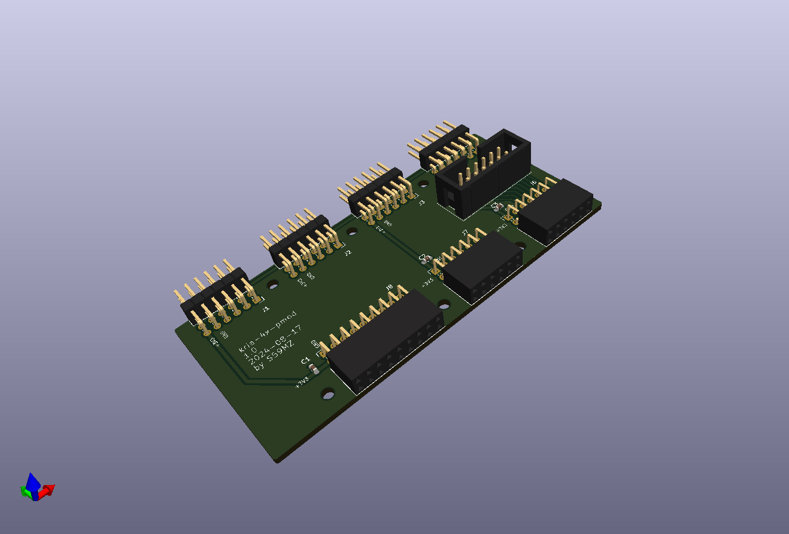
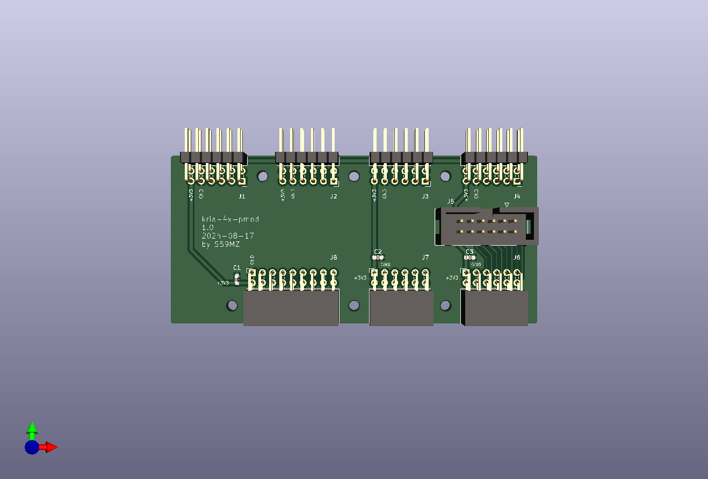
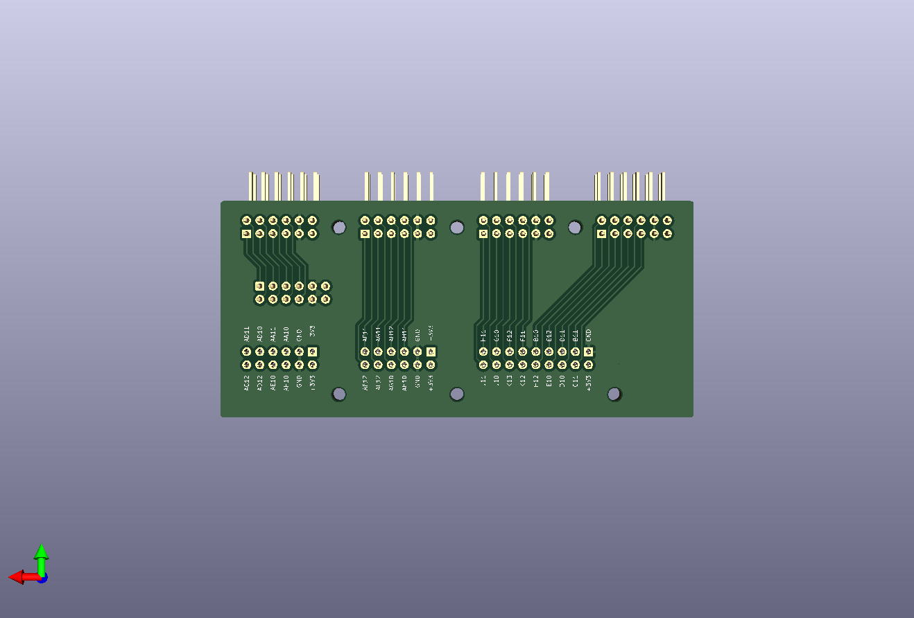

# kicad-kria-4x-pmod
Adapter for Kria KR260 board for 4xPMOD interfaces

Schematic:
[kicad-kria-4x-pmod.pdf](kicad-kria-4x-pmod.pdf)

BOM:
[kicad-kria-4x-pmod.csv](kicad-kria-4x-pmod.csv)

Gerbers:
[gerbers.zip](https://github.com/s59mz/kicad-kria-4x-pmod/raw/main/gerbers.zip)
